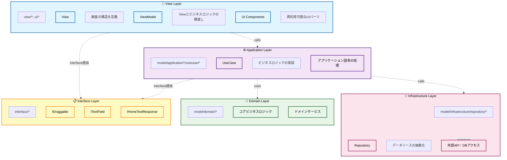
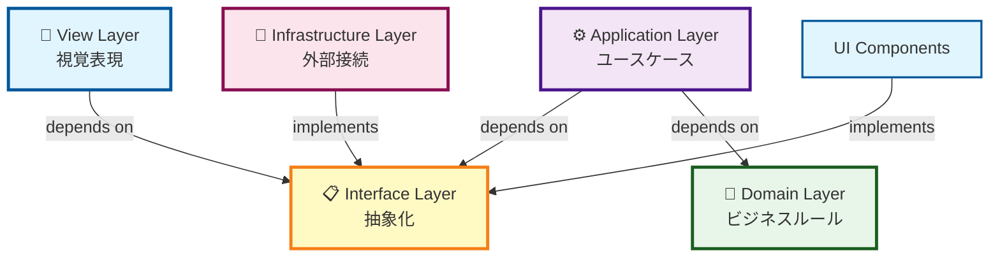
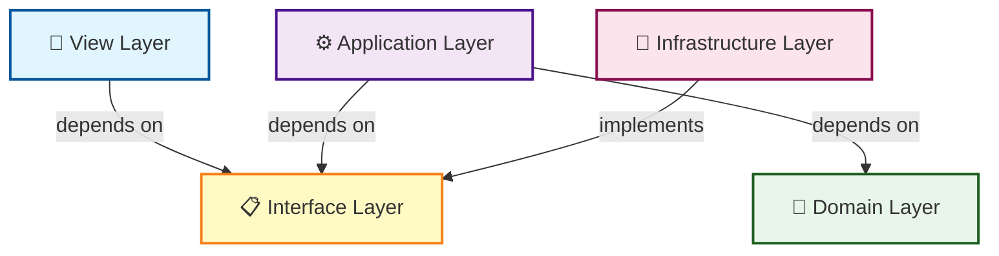
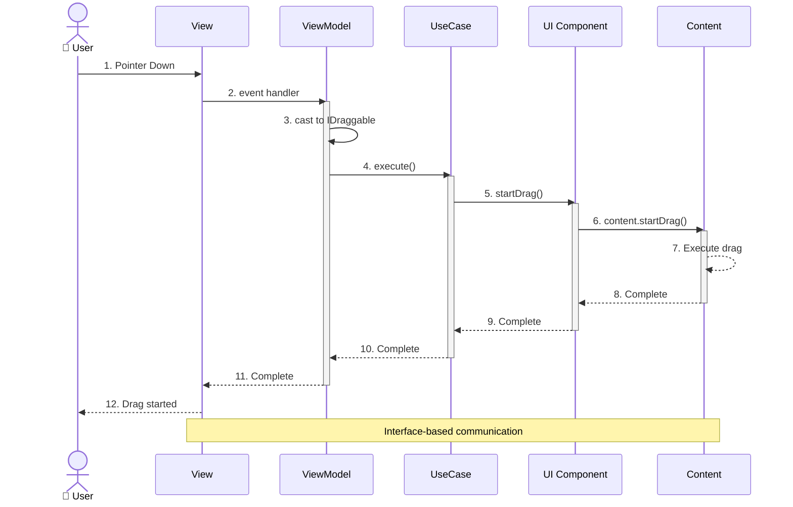
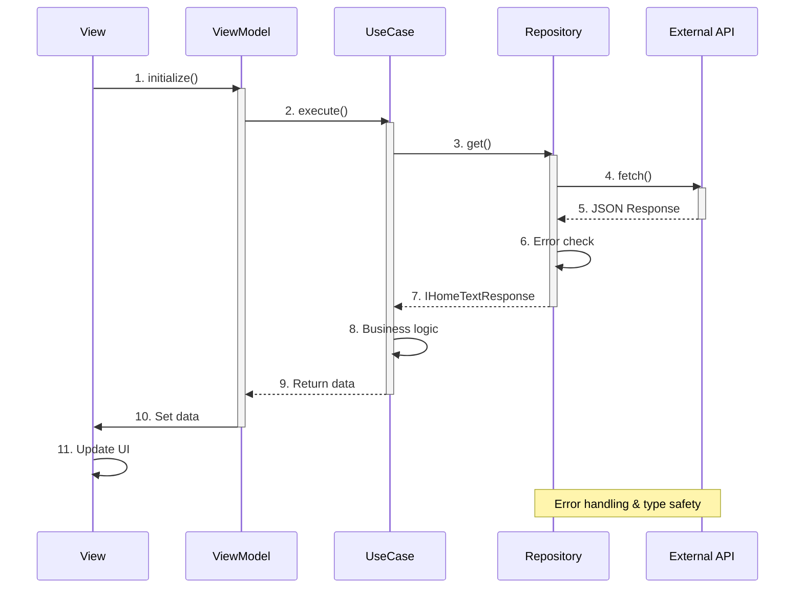
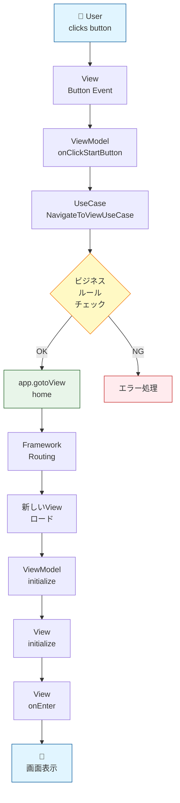

# Clean Architecture & MVVM Implementation

このプロジェクトは、クリーンアーキテクチャとMVVMパターンを組み合わせて実装されています。

This project implements a combination of Clean Architecture and MVVM pattern.

## アーキテクチャの概要 / Architecture Overview



### レイヤー間の依存関係 / Layer Dependencies



### 依存関係の方向 / Dependency Direction

クリーンアーキテクチャの原則に従い、依存関係は常に内側（Domain層）に向かい、外側の層は内側の層を知りません。

Following Clean Architecture principles, dependencies always point inward (toward the Domain layer), and outer layers don't know about inner layers.



- **View層**: インターフェースを通じてApplication層を使用
- **Application層**: インターフェースを通じてDomain層とInfrastructure層を使用
- **Domain層**: 何にも依存しない（純粋なビジネスロジック）
- **Infrastructure層**: Domain層のインターフェースを実装

### ファイル・ディレクトリ一覧 / File & Directory List

```
src/
├── 📋 interface/             # インターフェース定義
│   ├── IDraggable.ts         # ドラッグ可能なオブジェクト
│   ├── ITextField.ts         # テキストフィールド
│   └── IHomeTextResponse.ts  # API レスポンス型
│
├── 🎨 view/                  # View & ViewModel
│   ├── home/
│   │   ├── HomeView.ts       # 画面の構造定義
│   │   └── HomeViewModel.ts  # ビジネスロジックとの橋渡し
│   └── top/
│       ├── TopView.ts
│       └── TopViewModel.ts
│
├── ⚙️ model/
│   ├── application/          # アプリケーション層
│   │   ├── home/
│   │   │   └── usecase/     # ビジネスロジック実装
│   │   │       ├── StartDragUseCase.ts
│   │   │       ├── StopDragUseCase.ts
│   │   │       └── CenterTextFieldUseCase.ts
│   │   └── top/
│   │       └── usecase/
│   │           └── NavigateToViewUseCase.ts
│   │
│   ├── 💎 domain/            # ドメイン層
│   │   └── callback/        # コアビジネスロジック
│   │       └── Background.ts
│   │
│   └── 🔧 infrastructure/    # インフラ層
│       └── repository/
│           └── HomeTextRepository.ts # データアクセス
│
└── 🎨 ui/                    # UIコンポーネント
    ├── component/
    │   ├── atom/            # 最小単位のコンポーネント
    │   │   ├── ButtonAtom.ts
    │   │   └── TextAtom.ts
    │   └── molecule/        # Atomを組み合わせたコンポーネント
    │       ├── HomeBtnMolecule.ts
    │       └── TopBtnMolecule.ts
    └── content/             # Animation Tool生成コンテンツ
        ├── HomeContent.ts
        └── TopContent.ts
```

## 主要な設計パターン / Key Design Patterns

### 1. MVVM (Model-View-ViewModel)

- **View**: 画面の構造と表示を担当。ビジネスロジックは持たない
- **ViewModel**: ViewとModelの橋渡し。UseCaseを保持し、イベントを処理
- **Model**: ビジネスロジックとデータアクセスを担当

### 2. UseCase パターン

各ユーザーアクションに対して、専用のUseCaseクラスを作成:

```typescript
// 例: ドラッグ開始のユースケース
export class StartDragUseCase {
    execute(target: IDraggable): void {
        target.startDrag();
    }
}
```

### 3. Dependency Inversion (依存性の逆転)

具象クラスではなく、インターフェースに依存:

```typescript
// ❌ 悪い例: 具象クラスに依存
import { HomeContent } from "@/ui/content/HomeContent";
function startDrag(content: HomeContent) { ... }

// ✅ 良い例: インターフェースに依存
import type { IDraggable } from "@/interface/IDraggable";
function startDrag(target: IDraggable) { ... }
```

### 4. Repository パターン

データアクセスを抽象化し、エラーハンドリングも実装:

```typescript
export class HomeTextRepository {
    static async get(): Promise<IHomeTextResponse> {
        try {
            const response = await fetch(...);
            if (!response.ok) {
                throw new Error(`HTTP error! status: ${response.status}`);
            }
            return await response.json();
        } catch (error) {
            console.error("Failed to fetch:", error);
            throw error;
        }
    }
}
```

## データフロー / Data Flow

### 例: ドラッグ操作の場合 / Example: Drag Operation



### データ取得フロー / Data Fetch Flow



### 画面遷移フロー / View Navigation Flow



### コード例 / Code Example

```typescript
// 1. View: イベントハンドリング
homeContent.addEventListener(PointerEvent.POINTER_DOWN,
    this.vm.homeContentPointerDownEvent
);

// 2. ViewModel: UseCaseの実行
homeContentPointerDownEvent(event: PointerEvent): void {
    const target = event.currentTarget as unknown as IDraggable;
    this.startDragUseCase.execute(target);
}

// 3. UseCase: ビジネスロジック
execute(target: IDraggable): void {
    // ビジネスルール: ドラッグ可能かチェック
    target.startDrag();
}

// 4. UI Component: 実装
export class HomeBtnMolecule implements IDraggable {
    startDrag(): void {
        this.homeContent.startDrag();
    }
}
```

## テスタビリティ / Testability

インターフェースと依存性注入により、各層を独立してテスト可能:

```typescript
// UseCaseのテスト例
test('StartDragUseCase should call startDrag', () => {
    const mockDraggable: IDraggable = {
        startDrag: jest.fn(),
        stopDrag: jest.fn()
    };
    
    const useCase = new StartDragUseCase();
    useCase.execute(mockDraggable);
    
    expect(mockDraggable.startDrag).toHaveBeenCalled();
});
```

## ベストプラクティス / Best Practices

1. **インターフェース優先**: 具象型ではなく、常にインターフェースに依存
2. **単一責任の原則**: 各クラスは1つの責務のみを持つ
3. **依存性注入**: コンストラクタで依存を注入（将来的にDIコンテナも検討可能）
4. **エラーハンドリング**: Repository層で適切にエラーを処理
5. **型安全性**: `any`型を避け、明示的な型定義を使用

## 今後の改善案 / Future Improvements

1. **DIコンテナの導入**: UseCaseのインスタンス管理を自動化
2. **State管理の追加**: 複雑な状態管理が必要な場合
3. **Presenter層の追加**: ViewModelの責務をさらに分離
4. **E2Eテストの追加**: 実際のユーザーフローをテスト
