# Clean Architecture & MVVM Implementation

このプロジェクトは、クリーンアーキテクチャとMVVMパターンを組み合わせて実装されています。

This project implements a combination of Clean Architecture and MVVM pattern.

## アーキテクチャの概要 / Architecture Overview

```mermaid
graph TB
    subgraph ViewLayer["🎨 View Layer<br/>(view/*, ui/*)"]
        View["View<br/>画面の構造を定義"]
        ViewModel["ViewModel<br/>Viewとビジネスロジックの橋渡し"]
        UI["UI Components<br/>再利用可能なUIパーツ"]
    end

    subgraph InterfaceLayer["📋 Interface Layer<br/>(interface/*)"]
        IDraggable["IDraggable"]
        ITextField["ITextField"]
        IResponse["IHomeTextResponse"]
    end

    subgraph ApplicationLayer["⚙️ Application Layer<br/>(model/application/*/usecase/*)"]
        UseCase["UseCase<br/>ビジネスロジックの実装"]
        AppLogic["アプリケーション固有の処理"]
    end

    subgraph DomainLayer["💎 Domain Layer<br/>(model/domain/*)"]
        DomainLogic["コアビジネスロジック"]
        DomainService["ドメインサービス"]
    end

    subgraph InfraLayer["🔧 Infrastructure Layer<br/>(model/infrastructure/repository/*)"]
        Repository["Repository<br/>データソースの抽象化"]
        ExternalAPI["外部API・DBアクセス"]
    end

    %% 依存関係
    View -.->|uses| ViewModel
    ViewModel -.->|depends on| InterfaceLayer
    ViewModel -.->|calls| UseCase
    UseCase -.->|implements| InterfaceLayer
    UseCase -.->|uses| DomainLogic
    UseCase -.->|calls| Repository
    Repository -.->|accesses| ExternalAPI
    DomainService -.->|uses| DomainLogic
    UI -.->|implements| InterfaceLayer

    %% スタイル
    classDef viewStyle fill:#e1f5ff,stroke:#01579b,stroke-width:2px,color:#000
    classDef interfaceStyle fill:#fff9c4,stroke:#f57f17,stroke-width:2px,color:#000
    classDef appStyle fill:#f3e5f5,stroke:#4a148c,stroke-width:2px,color:#000
    classDef domainStyle fill:#e8f5e9,stroke:#1b5e20,stroke-width:2px,color:#000
    classDef infraStyle fill:#fce4ec,stroke:#880e4f,stroke-width:2px,color:#000

    class View,ViewModel,UI viewStyle
    class IDraggable,ITextField,IResponse interfaceStyle
    class UseCase,AppLogic appStyle
    class DomainLogic,DomainService domainStyle
    class Repository,ExternalAPI infraStyle
```



### レイヤー間の依存関係 / Layer Dependencies

```mermaid
flowchart LR
    View["View Layer<br/>視覚表現"]
    Interface["Interface Layer<br/>抽象化"]
    App["Application Layer<br/>ユースケース"]
    Domain["Domain Layer<br/>ビジネスルール"]
    Infra["Infrastructure Layer<br/>外部接続"]

    View -->|depends on| Interface
    App -->|depends on| Interface
    App -->|depends on| Domain
    Infra -->|implements| Interface
    UI["UI Components"] -->|implements| Interface

    style View fill:#e1f5ff,stroke:#01579b,stroke-width:3px
    style Interface fill:#fff9c4,stroke:#f57f17,stroke-width:3px
    style App fill:#f3e5f5,stroke:#4a148c,stroke-width:3px
    style Domain fill:#e8f5e9,stroke:#1b5e20,stroke-width:3px
    style Infra fill:#fce4ec,stroke:#880e4f,stroke-width:3px
    style UI fill:#e1f5ff,stroke:#01579b,stroke-width:2px
```



### 依存関係の方向 / Dependency Direction

クリーンアーキテクチャの原則に従い、依存関係は常に内側（Domain層）に向かい、外側の層は内側の層を知りません。

Following Clean Architecture principles, dependencies always point inward (toward the Domain layer), and outer layers don't know about inner layers.


- **View層**: インターフェースを通じてApplication層を使用
- **Application層**: インターフェースを通じてDomain層とInfrastructure層を使用
- **Domain層**: 何にも依存しない（純粋なビジネスロジック）
- **Infrastructure層**: Domain層のインターフェースを実装

## ディレクトリ構造 / Directory Structure


### ファイル・ディレクトリ一覧 / File & Directory List

```
src/
├── 📋 interface/              # インターフェース定義
│   ├── IDraggable.ts         # ドラッグ可能なオブジェクト
│   ├── ITextField.ts         # テキストフィールド
│   └── IHomeTextResponse.ts  # API レスポンス型
│
├── 🎨 view/                   # View & ViewModel
│   ├── home/
│   │   ├── HomeView.ts       # 画面の構造定義
│   │   └── HomeViewModel.ts  # ビジネスロジックとの橋渡し
│   └── top/
│       ├── TopView.ts
│       └── TopViewModel.ts
│
├── ⚙️ model/
│   ├── application/          # アプリケーション層
│   │   ├── home/
│   │   │   └── usecase/     # ビジネスロジック実装
│   │   │       ├── StartDragUseCase.ts
│   │   │       ├── StopDragUseCase.ts
│   │   │       └── CenterTextFieldUseCase.ts
│   │   └── top/
│   │       └── usecase/
│   │           └── NavigateToViewUseCase.ts
│   │
│   ├── 💎 domain/            # ドメイン層
│   │   └── callback/        # コアビジネスロジック
│   │       └── Background.ts
│   │
│   └── 🔧 infrastructure/    # インフラ層
│       └── repository/
│           └── HomeTextRepository.ts # データアクセス
│
└── 🎨 ui/                    # UIコンポーネント
    ├── component/
    │   ├── atom/            # 最小単位のコンポーネント
    │   │   ├── ButtonAtom.ts
    │   │   └── TextAtom.ts
    │   └── molecule/        # Atomを組み合わせたコンポーネント
    │       ├── HomeBtnMolecule.ts
    │       └── TopBtnMolecule.ts
    └── content/             # Animation Tool生成コンテンツ
        ├── HomeContent.ts
        └── TopContent.ts
```

## 主要な設計パターン / Key Design Patterns

### 1. MVVM (Model-View-ViewModel)

- **View**: 画面の構造と表示を担当。ビジネスロジックは持たない
- **ViewModel**: ViewとModelの橋渡し。UseCaseを保持し、イベントを処理
- **Model**: ビジネスロジックとデータアクセスを担当

### 2. UseCase パターン

各ユーザーアクションに対して、専用のUseCaseクラスを作成:

```typescript
// 例: ドラッグ開始のユースケース
export class StartDragUseCase {
    execute(target: IDraggable): void {
        target.startDrag();
    }
}
```

### 3. Dependency Inversion (依存性の逆転)

具象クラスではなく、インターフェースに依存:

```typescript
// ❌ 悪い例: 具象クラスに依存
import { HomeContent } from "@/ui/content/HomeContent";
function startDrag(content: HomeContent) { ... }

// ✅ 良い例: インターフェースに依存
import type { IDraggable } from "@/interface/IDraggable";
function startDrag(target: IDraggable) { ... }
```

### 4. Repository パターン

データアクセスを抽象化し、エラーハンドリングも実装:

```typescript
export class HomeTextRepository {
    static async get(): Promise<IHomeTextResponse> {
        try {
            const response = await fetch(...);
            if (!response.ok) {
                throw new Error(`HTTP error! status: ${response.status}`);
            }
            return await response.json();
        } catch (error) {
            console.error("Failed to fetch:", error);
            throw error;
        }
    }
}
```

## データフロー / Data Flow

### 例: ドラッグ操作の場合 / Example: Drag Operation

```mermaid
sequenceDiagram
    actor User as 👤 User
    participant View as View<br/>(HomeView)
    participant VM as ViewModel<br/>(HomeViewModel)
    participant UC as UseCase<br/>(StartDragUseCase)
    participant UI as UI Component<br/>(HomeBtnMolecule)
    participant Content as Content<br/>(HomeContent)

    User->>View: 1. ポインターダウン<br/>(Pointer Down)
    View->>VM: 2. homeContentPointerDownEvent(event)
    activate VM
    VM->>VM: 3. event.currentTarget as IDraggable
    VM->>UC: 4. execute(target)
    activate UC
    UC->>UI: 5. target.startDrag()
    activate UI
    UI->>Content: 6. homeContent.startDrag()
    activate Content
    Content-->>Content: 7. ドラッグ処理実行<br/>(Execute drag)
    Content-->>UI: 8. 完了
    deactivate Content
    UI-->>UC: 9. 完了
    deactivate UI
    UC-->>VM: 10. 完了
    deactivate UC
    VM-->>View: 11. 完了
    deactivate VM
    View-->>User: 12. ドラッグ開始<br/>(Drag started)

    Note over View,Content: すべてインターフェース経由で通信<br/>All communication via interfaces
```



### データ取得フロー / Data Fetch Flow

```mermaid
sequenceDiagram
    participant View as View<br/>(HomeView)
    participant VM as ViewModel<br/>(HomeViewModel)
    participant UC as UseCase<br/>(FetchHomeTextUseCase)
    participant Repo as Repository<br/>(HomeTextRepository)
    participant API as External API<br/>(api/home.json)

    View->>VM: 1. initialize()
    activate VM
    VM->>UC: 2. execute()
    activate UC
    UC->>Repo: 3. get()
    activate Repo
    Repo->>API: 4. fetch()
    activate API
    API-->>Repo: 5. JSON Response
    deactivate API
    Repo->>Repo: 6. エラーチェック<br/>(Error check)
    Repo-->>UC: 7. IHomeTextResponse
    deactivate Repo
    UC->>UC: 8. ビジネスロジック<br/>(Business logic)
    UC-->>VM: 9. データ返却<br/>(Return data)
    deactivate UC
    VM->>View: 10. データをViewに設定<br/>(Set data to View)
    deactivate VM
    View->>View: 11. 画面更新<br/>(Update UI)

    Note over Repo,API: エラーハンドリングと<br/>型安全性を保証<br/>(Error handling &<br/>type safety)
```



### 画面遷移フロー / View Navigation Flow

```mermaid
flowchart TD
    A[👤 User clicks button] --> B[View<br/>Button Event]
    B --> C[ViewModel<br/>onClickStartButton]
    C --> D[UseCase<br/>NavigateToViewUseCase]
    D --> E{ビジネスルール<br/>チェック}
    E -->|OK| F[app.gotoView<br/>'home']
    E -->|NG| G[エラー処理]
    F --> H[Framework<br/>Routing処理]
    H --> I[新しいView<br/>ロード]
    I --> J[ViewModel<br/>initialize]
    J --> K[View<br/>initialize]
    K --> L[View<br/>onEnter]
    L --> M[🎨 画面表示]

    style A fill:#e1f5ff,stroke:#01579b
    style E fill:#fff9c4,stroke:#f57f17
    style F fill:#e8f5e9,stroke:#1b5e20
    style G fill:#ffebee,stroke:#c62828
    style M fill:#e1f5ff,stroke:#01579b
```



### コード例 / Code Example

```typescript
// 1. View: イベントハンドリング
homeContent.addEventListener(PointerEvent.POINTER_DOWN,
    this.vm.homeContentPointerDownEvent
);

// 2. ViewModel: UseCaseの実行
homeContentPointerDownEvent(event: PointerEvent): void {
    const target = event.currentTarget as unknown as IDraggable;
    this.startDragUseCase.execute(target);
}

// 3. UseCase: ビジネスロジック
execute(target: IDraggable): void {
    // ビジネスルール: ドラッグ可能かチェック
    target.startDrag();
}

// 4. UI Component: 実装
export class HomeBtnMolecule implements IDraggable {
    startDrag(): void {
        this.homeContent.startDrag();
    }
}
```

## テスタビリティ / Testability

インターフェースと依存性注入により、各層を独立してテスト可能:

```typescript
// UseCaseのテスト例
test('StartDragUseCase should call startDrag', () => {
    const mockDraggable: IDraggable = {
        startDrag: jest.fn(),
        stopDrag: jest.fn()
    };
    
    const useCase = new StartDragUseCase();
    useCase.execute(mockDraggable);
    
    expect(mockDraggable.startDrag).toHaveBeenCalled();
});
```

## ベストプラクティス / Best Practices

1. **インターフェース優先**: 具象型ではなく、常にインターフェースに依存
2. **単一責任の原則**: 各クラスは1つの責務のみを持つ
3. **依存性注入**: コンストラクタで依存を注入（将来的にDIコンテナも検討可能）
4. **エラーハンドリング**: Repository層で適切にエラーを処理
5. **型安全性**: `any`型を避け、明示的な型定義を使用

## 今後の改善案 / Future Improvements

1. **DIコンテナの導入**: UseCaseのインスタンス管理を自動化
2. **State管理の追加**: 複雑な状態管理が必要な場合
3. **Presenter層の追加**: ViewModelの責務をさらに分離
4. **E2Eテストの追加**: 実際のユーザーフローをテスト
