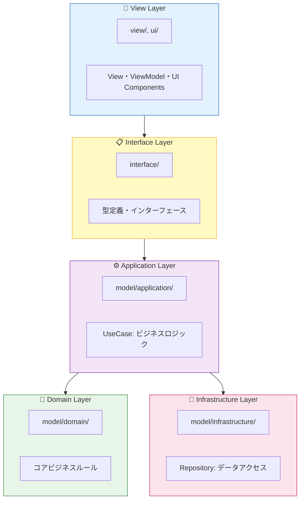

# Next2D Framework TypeScript Template

[Create Next2D App](https://github.com/Next2D/create-next2d-app) でブートストラップされたプロジェクトです。

This project was bootstrapped with [Create Next2D App](https://github.com/Next2D/create-next2d-app).

---

## 目次 / Table of Contents

- [必要な環境 / Requirements](#必要な環境--requirements)
- [セットアップ / Setup](#セットアップ--setup)
- [アーキテクチャ / Architecture](#アーキテクチャ--architecture)
- [開発サーバー / Development Server](#開発サーバー--development-server)
- [コード生成 / Code Generation](#コード生成--code-generation)
- [プラットフォームエミュレーター / Platform Emulators](#プラットフォームエミュレーター--platform-emulators)
- [ユニットテスト / Unit Test](#ユニットテスト--unit-test)
- [ビルド / Build](#ビルド--build)
- [ディレクトリ構成 / Directory Structure](#ディレクトリ構成--directory-structure)
- [📚 詳細ドキュメント / Detailed Documentation](#-詳細ドキュメント--detailed-documentation)
- [ライセンス / License](#ライセンス--license)

---

## 必要な環境 / Requirements

| ツール / Tool | バージョン / Version |
|--------------|---------------------|
| Node.js | 22.x 以上 / 22.x or higher |
| npm | 10.x 以上 / 10.x or higher |

### オプション / Optional

iOS/Androidビルドを行う場合は、以下も必要です。

For iOS/Android builds, the following are also required:

- **iOS**: Xcode 14 以上、macOS
- **Android**: Android Studio、JDK 21 以上

---

## セットアップ / Setup

### 1. リポジトリのクローン / Clone the repository

```bash
git clone <repository-url>
cd <project-directory>
```

### 2. 依存パッケージのインストール / Install dependencies

```bash
npm install
```

### 3. 開発サーバーの起動 / Start the development server

```bash
npm start
```

ブラウザで [http://localhost:5173](http://localhost:5173) を開いてください。

Open [http://localhost:5173](http://localhost:5173) in your browser.

---

## アーキテクチャ / Architecture

このプロジェクトは **MVVM + Clean Architecture + Atomic Design** を採用しています。

This project adopts **MVVM + Clean Architecture + Atomic Design**.



詳細は [ARCHITECTURE.md](./ARCHITECTURE.md) を参照してください。

See [ARCHITECTURE.md](./ARCHITECTURE.md) for details.

---

## 開発サーバー / Development Server

### `npm start`

開発モードでアプリケーションを起動します。  
[http://localhost:5173](http://localhost:5173) をブラウザで開いてください。  
コードを変更すると自動的にリロードされます。

Runs the app in development mode.  
Open [http://localhost:5173](http://localhost:5173) to view it in your browser.  
The page will reload when you make changes.

---

## コード生成 / Code Generation

### `npm run generate`

`routing.json` の設定に基づいて、必要な View と ViewModel クラスを自動生成します。  
新しい画面を追加する際に便利です。

Generates the necessary View and ViewModel classes from the `routing.json` file.  
Useful when adding new screens.

---

## プラットフォームエミュレーター / Platform Emulators

各プラットフォーム向けのエミュレーターを起動します。  
`--env` オプションで環境を指定できます（`dev`, `stg`, `prd` など）。

Launch emulators for each platform.  
You can specify the environment with the `--env` option (`dev`, `stg`, `prd`, etc.).

| コマンド / Command | プラットフォーム / Platform |
|-------------------|---------------------------|
| `npm run preview:windows -- --env prd` | Windows |
| `npm run preview:macos -- --env prd` | macOS |
| `npm run preview:linux -- --env prd` | Linux |
| `npm run preview:ios -- --env prd` | iOS |
| `npm run preview:android -- --env prd` | Android |

---

## ユニットテスト / Unit Test

### `npm test`

Vitest を使用してテストを実行します。

Runs tests using Vitest.

```bash
# 全テスト実行 / Run all tests
npm test

# ウォッチモード / Watch mode
npm test -- --watch

# カバレッジレポート / Coverage report
npm test -- --coverage
```

---

## ビルド / Build

各プラットフォーム向けにビルドを行います。  
`--env` オプションで環境を指定できます。

Build for each platform.  
You can specify the environment with the `--env` option.

| コマンド / Command | プラットフォーム / Platform | 出力先 / Output |
|-------------------|---------------------------|----------------|
| `npm run build:web -- --env prd` | Web (HTML) | `dist/web/prd/` |
| `npm run build:steam:windows -- --env prd` | Windows (Steam) | `dist/steam/windows/` |
| `npm run build:steam:macos -- --env prd` | macOS (Steam) | `dist/steam/macos/` |
| `npm run build:steam:linux -- --env prd` | Linux (Steam) | `dist/steam/linux/` |
| `npm run build:ios -- --env prd` | iOS | Xcode project |
| `npm run build:android -- --env prd` | Android | Android Studio project |

### 環境設定 / Environment Configuration

環境ごとの設定は `src/config/` ディレクトリで管理されています。

Environment-specific settings are managed in the `src/config/` directory.

---

## ディレクトリ構成 / Directory Structure

```
src/
├── config/                    # 設定ファイル / Configuration files
├── interface/                 # インターフェース定義 / Interface definitions
├── model/
│   ├── application/           # ユースケース / Use cases
│   ├── domain/                # ドメインロジック / Domain logic
│   └── infrastructure/        # リポジトリ / Repositories
├── ui/
│   ├── animation/             # アニメーション定義 / Animation definitions
│   ├── component/
│   │   ├── atom/              # 最小コンポーネント / Smallest components
│   │   └── molecule/          # 複合コンポーネント / Composite components
│   └── content/               # Animation Tool 生成 / Generated content
└── view/                      # View & ViewModel
```

各ディレクトリの詳細は、ディレクトリ内の `README.md` を参照してください。

See the `README.md` in each directory for details.

---

## 📚 詳細ドキュメント / Detailed Documentation

各ディレクトリには、実装ガイドとなるREADME.mdが配置されています。AIエージェントやコード生成ツールは、これらのドキュメントを参照することで、アーキテクチャに沿った実装が可能です。

Each directory contains a README.md that serves as an implementation guide. AI agents and code generation tools can reference these documents to implement code that follows the architecture.

### アーキテクチャ層 / Architecture Layers

| ドキュメント / Document | 説明 / Description |
|------------------------|-------------------|
| [src/model/README.md](./src/model/README.md) | Model層全体の概要、3層構造の説明 |
| [src/model/application/README.md](./src/model/application/README.md) | Application層：UseCaseパターンの実装ガイド |
| [src/model/domain/README.md](./src/model/domain/README.md) | Domain層：コアビジネスロジックの実装ガイド |
| [src/model/infrastructure/README.md](./src/model/infrastructure/README.md) | Infrastructure層：Repositoryパターンの実装ガイド |

### UIコンポーネント / UI Components

| ドキュメント / Document | 説明 / Description |
|------------------------|-------------------|
| [src/ui/README.md](./src/ui/README.md) | UI層全体の概要、アトミックデザイン階層 |
| [src/ui/component/README.md](./src/ui/component/README.md) | Atom/Molecule/Pageコンポーネントの実装ガイド |
| [src/ui/content/README.md](./src/ui/content/README.md) | Animation Toolコンテンツの実装ガイド |
| [src/ui/animation/README.md](./src/ui/animation/README.md) | アニメーション定義の実装ガイド |

### View/ViewModel & 設定 / View/ViewModel & Configuration

| ドキュメント / Document | 説明 / Description |
|------------------------|-------------------|
| [src/view/README.md](./src/view/README.md) | View/ViewModelのMVVMパターン実装ガイド |
| [src/config/README.md](./src/config/README.md) | 設定ファイル（stage.json, config.json, routing.json）の詳細 |
| [src/interface/README.md](./src/interface/README.md) | インターフェース定義と型安全性のガイド |

### 静的アセット / Static Assets

| ドキュメント / Document | 説明 / Description |
|------------------------|-------------------|
| [src/assets/README.md](./src/assets/README.md) | 画像・JSONなど静的ファイルの管理ガイド |

---

## ライセンス / License

MIT License

---

## 関連リンク / Related Links

- [Next2D Player](https://github.com/Next2D/player) - レンダリングエンジン / Rendering engine
- [Next2D Framework](https://github.com/Next2D/framework) - フレームワーク / Framework
- [Create Next2D App](https://github.com/Next2D/create-next2d-app) - プロジェクト生成ツール / Project generator
- [Next2D Animation Tool](https://tool.next2d.app/) - アニメーション作成ツール / Animation creation tool