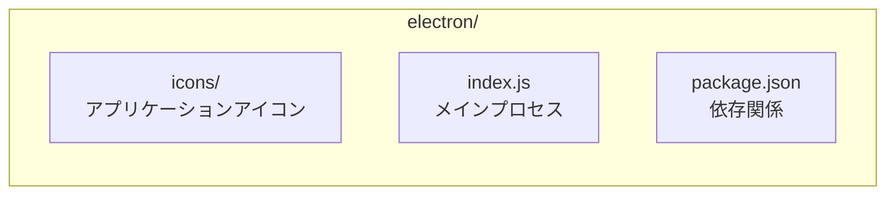

# Electron Configuration

Windows、macOS、Linux向けのデスクトップアプリケーションビルドに使用するElectron設定ディレクトリです。

Directory for Electron configuration used to build desktop applications for Windows, macOS, and Linux.

## ディレクトリ構造 / Directory Structure



## ファイル説明 / File Description

### index.js

Electronのメインプロセスを定義します。ウィンドウの作成、アプリケーションのライフサイクル管理などを行います。

Defines the Electron main process. Handles window creation, application lifecycle management, etc.

### package.json

Electron用の依存関係と設定を管理します。

Manages Electron-specific dependencies and configuration.

### icons/

各プラットフォーム向けのアプリケーションアイコンを格納します。詳細は [icons/README.md](./icons/README.md) を参照してください。

Contains application icons for each platform. See [icons/README.md](./icons/README.md) for details.

## ビルドコマンド / Build Commands

```bash
# Windows向けビルド / Build for Windows
npm run build:steam:windows -- --env prd

# macOS向けビルド / Build for macOS
npm run build:steam:macos -- --env prd

# Linux向けビルド / Build for Linux
npm run build:steam:linux -- --env prd
```

## エミュレーター / Emulator

開発中にデスクトップアプリとしてプレビューできます。

Preview as a desktop application during development.

```bash
# Windows / macOS / Linux エミュレーター
npm run preview:windows -- --env dev
npm run preview:macos -- --env dev
npm run preview:linux -- --env dev
```

## カスタマイズ / Customization

### ウィンドウ設定 / Window Settings

`index.js` でウィンドウのサイズや設定をカスタマイズできます。

Customize window size and settings in `index.js`.

### アイコン変更 / Icon Change

`icons/` ディレクトリ内の画像を置き換えてアプリケーションアイコンを変更します。

Replace images in the `icons/` directory to change application icons.

## 関連ドキュメント / Related Documentation

- [README.md](../README.md) - プロジェクト全体の説明
- [icons/README.md](./icons/README.md) - アイコン設定
