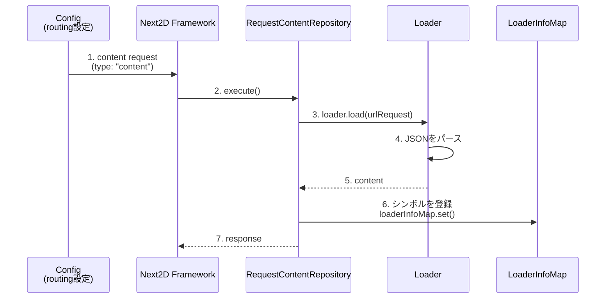

# Mock Content

ローカル開発用のモックコンテンツデータを格納するディレクトリです。

Directory for storing mock content data for local development.

## 概要 / Overview

Next2D Animation Toolからエクスポートされたコンテンツのモックデータを配置します。`http://localhost:5173/content/` でアクセス可能です。

Place mock data for content exported from the Next2D Animation Tool. Accessible at `http://localhost:5173/content/`.

## ファイル一覧 / File List

### sample.json

Next2D Animation Toolから書き出されたJSONファイルです。Next2D Frameworkの`RequestContentRepository`によって読み込まれ、シンボル（MovieClip等）がLoaderInfoMapに登録されます。

JSON file exported from the Next2D Animation Tool. It is loaded by `RequestContentRepository` in the Next2D Framework, and symbols (MovieClip, etc.) are registered in the LoaderInfoMap.

**アクセスURL:** `http://localhost:5173/content/sample.json`

## 読み込みの仕組み / Loading Mechanism



### Framework側の処理

Frameworkの[RequestContentRepository](https://github.com/Next2D/framework/blob/develop/src/infrastructure/Request/repository/RequestContentRepository.ts)で以下の処理が行われます：

The following processing is performed in the Framework's [RequestContentRepository](https://github.com/Next2D/framework/blob/develop/src/infrastructure/Request/repository/RequestContentRepository.ts):

1. **JSONの読み込み**: `Loader`クラスでJSONを非同期取得
2. **シンボル登録**: Animation Toolで設定したシンボル名を`LoaderInfoMap`に登録
3. **コンテンツ返却**: `ui/content/`のクラスから参照可能に

## 設定例 / Configuration Example

`src/config/Config.ts`での設定例：

```typescript
{
    "routing": {
        "@sample": {
            "requests": [
                {
                    "type": "content",
                    "path": "https://example.com/content/sample.json",
                    "name": "MainContent",
                    "cache": true
                }
            ]
        }
    }
}
```

## 使用方法 / Usage

### 1. Animation Toolでコンテンツ作成

[Next2D Animation Tool](https://tool.next2d.app/)でアニメーションを作成し、JSONとしてエクスポートします。

Create animations in [Next2D Animation Tool](https://tool.next2d.app/) and export as JSON.

### 2. モックディレクトリに配置

エクスポートしたJSONをこのディレクトリに配置します。

Place the exported JSON in this directory.

### 3. Configでパスを設定

開発環境ではローカルパス、本番環境では実サーバーのパスを設定します。

Set local path for development and actual server path for production.

## モックコンテンツの追加 / Adding Mock Content

### 手順 / Steps

1. Animation ToolでMovieClip等を作成
2. JSONとしてエクスポート
3. このディレクトリに配置
4. `src/ui/content/`にコンテンツクラスを作成
5. `Config.ts`のroutingに設定を追加

## 注意事項 / Notes

- モックコンテンツは開発環境でのみ使用してください
- 本番環境では実際のコンテンツサーバーを設定してください
- `cache: true`を設定すると、同じコンテンツの再読み込みを防げます

- Use mock content only in development environments
- Set actual content server in production environments
- Setting `cache: true` prevents reloading the same content

## 関連ドキュメント / Related Documentation

- [../README.md](../README.md) - Mockディレクトリの説明 / Mock directory overview
- [../../file/README.md](../../file/README.md) - n2dファイルの格納場所 / n2d file storage
- [../../src/ui/content/README.md](../../src/ui/content/README.md) - Animation Toolコンテンツクラス / Content classes
- [Next2D Animation Tool](https://tool.next2d.app/) - アニメーション作成ツール / Animation creation tool
- [RequestContentRepository (GitHub)](https://github.com/Next2D/framework/blob/develop/src/infrastructure/Request/repository/RequestContentRepository.ts) - Framework側の読み込み処理 / Framework loading process
