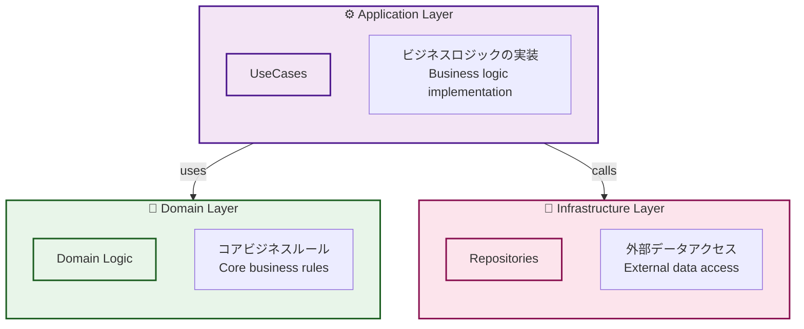
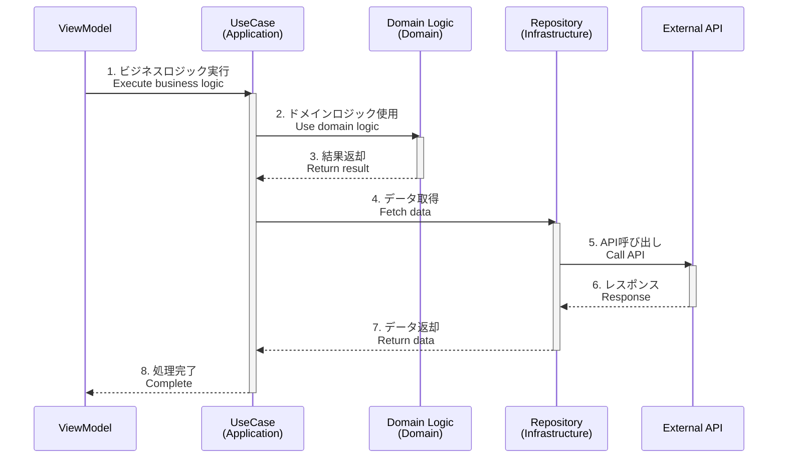
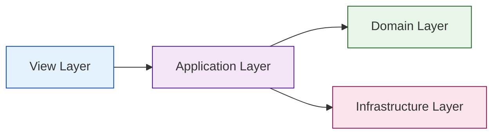

# Model

アプリケーションのビジネスロジックとデータアクセスを担当するディレクトリです。クリーンアーキテクチャに基づき、Application、Domain、Infrastructureの3層で構成されています。

This directory is responsible for business logic and data access. Based on Clean Architecture, it consists of three layers: Application, Domain, and Infrastructure.

## 📁 現在のディレクトリ構造 / Current Directory Structure

```
model/
├── application/                                # アプリケーション層
│   ├── home/
│   │   └── usecase/
│   │       ├── StartDragUseCase.ts
│   │       ├── StopDragUseCase.ts
│   │       └── CenterTextFieldUseCase.ts
│   └── top/
│       └── usecase/
│           └── NavigateToViewUseCase.ts
├── domain/                                     # ドメイン層
│   └── callback/
│       ├── Background.ts                       # コールバッククラス本体
│       └── Background/
│           └── service/
│               ├── BackgroundDrawService.ts
│               └── BackgroundChangeScaleService.ts
└── infrastructure/                             # インフラ層
    └── repository/
        └── HomeTextRepository.ts
```

## 🎨 アーキテクチャ概要 / Architecture Overview



## ⚙️ Application Layer

### 役割 / Role

- ユーザーのアクションに対応するビジネスロジックを実装
- 各ユーザーアクションごとにUseCaseクラスを作成
- インターフェースを通じてDomainとInfrastructureにアクセス

Implements business logic corresponding to user actions. Creates a UseCase class for each user action. Accesses Domain and Infrastructure through interfaces.

### ディレクトリ構造 / Directory Structure

```
application/
├── home/                           # Home画面
│   └── usecase/
│       ├── StartDragUseCase.ts
│       ├── StopDragUseCase.ts
│       └── CenterTextFieldUseCase.ts
└── top/                            # Top画面
    └── usecase/
        └── NavigateToViewUseCase.ts
```

### 実装例 / Implementation Example

#### StartDragUseCase.ts

```typescript
import type { IDraggable } from "@/interface/IDraggable";

export class StartDragUseCase {
    /**
     * @description ドラッグ可能なオブジェクトのドラッグを開始
     *              Start dragging a draggable object
     */
    execute(target: IDraggable): void {
        target.startDrag();
    }
}
```

#### NavigateToViewUseCase.ts

```typescript
import { app } from "@next2d/framework";

export class NavigateToViewUseCase {
    /**
     * @description 指定された画面に遷移
     *              Navigate to the specified view
     */
    async execute(viewName: string): Promise<void> {
        await app.gotoView(viewName);
    }
}
```

### 特徴 / Features

- ✅ **単一責任** - 1つのUseCaseは1つの責務のみ
- ✅ **インターフェース指向** - 抽象に依存、具象に依存しない
- ✅ **再利用可能** - 異なるViewModelから呼び出し可能
- ✅ **テスタブル** - 独立してユニットテスト可能

詳細は [application/README.md](./application/README.md) を参照してください。

See [application/README.md](./application/README.md) for details.

## 💎 Domain Layer

### 役割 / Role

- アプリケーションのコアとなるビジネスルールを実装
- フレームワークや外部ライブラリに依存しない純粋なロジック
- アプリケーション全体で共通して使用される処理

Implements the core business rules of the application. Pure logic that doesn't depend on frameworks or external libraries. Commonly used processes throughout the application.

### ディレクトリ構造 / Directory Structure

```
domain/
└── callback/
    └── Background/
        ├── Background.ts                       # グラデーション背景
        └── service/
            ├── BackgroundDrawService.ts        # 描画サービス
            └── BackgroundChangeScaleService.ts # スケール変更
```

### 実装例 / Implementation Example

#### Background.ts

```typescript
import { Shape, stage } from "@next2d/display";
import { Event } from "@next2d/events";

/**
 * @description グラデーション背景
 *              Gradient background
 */
export class Background {
    public readonly shape: Shape;

    constructor() {
        this.shape = new Shape();
        
        // リサイズイベントをリスン
        stage.addEventListener(Event.RESIZE, (): void => {
            backgroundDrawService(this);
            backgroundChangeScaleService(this);
        });
    }

    execute(): void {
        const context = app.getContext();
        const view = context.view;
        if (!view) return;

        // 背景を最背面に配置
        view.addChildAt(this.shape, 0);
    }
}
```

#### BackgroundDrawService.ts

```typescript
import type { Background } from "../Background";
import { config } from "@/config/Config";
import { Matrix } from "@next2d/geom";

/**
 * @description 背景のグラデーション描画を実行
 *              Execute background gradient drawing
 */
export const execute = (background: Background): void => {
    const width = config.stage.width;
    const height = config.stage.height;

    const matrix = new Matrix();
    matrix.createGradientBox(height, width, Math.PI / 2, 0, 0);

    background.shape.graphics
        .clear()
        .beginGradientFill(
            "linear",
            ["#1461A0", "#ffffff"],
            [0.6, 1],
            [0, 255],
            matrix
        )
        .drawRect(0, 0, width, height)
        .endFill();
};
```

### 特徴 / Features

- ✅ **フレームワーク非依存** - 可能な限り純粋なTypeScript
- ✅ **再利用可能** - アプリケーション全体で利用
- ✅ **安定性** - 外部の変更に影響されにくい
- ✅ **テスタブル** - 外部依存が最小限

詳細は [domain/README.md](./domain/README.md) を参照してください。

See [domain/README.md](./domain/README.md) for details.

## 🔧 Infrastructure Layer

### 役割 / Role

- 外部システムとの連携（API、データベース等）
- データアクセスの実装
- エラーハンドリングと型安全性の保証

Integrates with external systems (APIs, databases, etc.). Implements data access. Ensures error handling and type safety.

### ディレクトリ構造 / Directory Structure

```
infrastructure/
└── repository/
    └── HomeTextRepository.ts   # Home画面テキストデータ
```

### 実装例 / Implementation Example

#### HomeTextRepository.ts

```typescript
import type { IHomeTextResponse } from "@/interface/IHomeTextResponse";
import { config } from "@/config/Config";

export class HomeTextRepository {
    /**
     * @description Home画面のテキストデータを取得
     *              Get text data for Home screen
     */
    static async get(): Promise<IHomeTextResponse> {
        try {
            const response = await fetch(
                `${config.api.endPoint}api/home.json`
            );

            if (!response.ok) {
                throw new Error(`HTTP error! status: ${response.status}`);
            }

            return await response.json() as IHomeTextResponse;
        } catch (error) {
            console.error('Failed to fetch home text:', error);
            throw error;
        }
    }
}
```

### 特徴 / Features

- ✅ **型安全性** - `any`型を避け、明示的な型定義
- ✅ **エラーハンドリング** - すべての外部アクセスでtry-catch
- ✅ **設定の外部化** - エンドポイントは`config`から取得
- ✅ **テスタブル** - モックに差し替え可能

詳細は [infrastructure/README.md](./infrastructure/README.md) を参照してください。

See [infrastructure/README.md](./infrastructure/README.md) for details.

## 🔄 レイヤー間の関係 / Layer Relationships



## 📋 設計原則 / Design Principles

### 1. 依存関係の方向 / Dependency Direction



- **Application層** は **Domain層** と **Infrastructure層** に依存
- **Domain層** は何にも依存しない（最も安定）
- **Infrastructure層** は **Interface層** を実装

### 2. インターフェース駆動 / Interface-Driven

すべての層間通信はインターフェースを経由:

All inter-layer communication goes through interfaces:

```typescript
// ✅ 良い例: インターフェースに依存
import type { IDraggable } from "@/interface/IDraggable";
export class StartDragUseCase {
    execute(target: IDraggable): void { ... }
}

// ❌ 悪い例: 具象クラスに依存
import { HomeBtnMolecule } from "@/ui/component/molecule/HomeBtnMolecule";
export class StartDragUseCase {
    execute(target: HomeBtnMolecule): void { ... }
}
```

### 3. 単一責任の原則 / Single Responsibility Principle

各クラスは1つの明確な責務のみを持ちます。

Each class has one clear responsibility.

```typescript
// ✅ 良い例: 単一の責務
export class StartDragUseCase {
    execute(target: IDraggable): void {
        target.startDrag();
    }
}

export class StopDragUseCase {
    execute(target: IDraggable): void {
        target.stopDrag();
    }
}
```

## 🆕 新しい機能の追加方法 / Adding New Features

### 1. UseCase（Application層）の追加

```sh
# 1. ディレクトリ作成
model/application/{screen-name}/usecase/

# 2. UseCaseファイル作成
model/application/{screen-name}/usecase/YourUseCase.ts

# 3. インターフェース定義（必要に応じて）
interface/IYourInterface.ts
```

### 2. Domain Logicの追加

```sh
# 1. ディレクトリ作成
model/domain/{feature-name}/

# 2. ドメインロジック作成
model/domain/{feature-name}/YourDomainLogic.ts
model/domain/{feature-name}/service/YourService.ts
```

### 3. Repositoryの追加

```sh
# 1. インターフェース定義
interface/IYourResponse.ts

# 2. Repository作成
model/infrastructure/repository/YourRepository.ts
```

## ✅ ベストプラクティス / Best Practices

1. **インターフェース優先** - 常にインターフェースに依存
2. **1クラス1責務** - UseCaseは単一の目的のみ
3. **executeメソッド** - UseCaseのエントリーポイントを統一
4. **エラーハンドリング** - Infrastructure層で適切に処理
5. **型安全性** - `any`型を避ける
6. **ドキュメント** - JSDocで処理内容を明記
7. **テスト** - 各層を独立してテスト可能に

## 🔗 関連ドキュメント / Related Documentation

- [../ARCHITECTURE.md](../../ARCHITECTURE.md) - アーキテクチャ全体の説明
- [application/README.md](./application/README.md) - Application層の詳細
- [domain/README.md](./domain/README.md) - Domain層の詳細
- [infrastructure/README.md](./infrastructure/README.md) - Infrastructure層の詳細
- [../interface/README.md](../interface/README.md) - インターフェース定義
- [../view/README.md](../view/README.md) - View層の説明
- [../ui/README.md](../ui/README.md) - UIコンポーネント