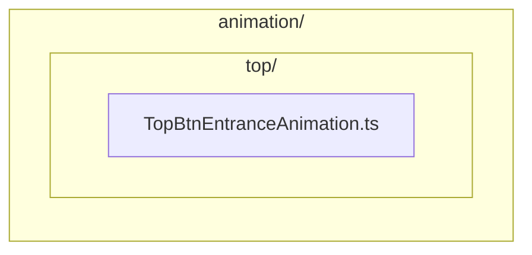

# Animation Definitions

コンポーネントのアニメーションロジックを格納するディレクトリです。

Directory for storing animation logic for components.

## 概要 / Overview

アニメーション定義をコンポーネントから分離することで、コードの再利用性と保守性を向上させます。

Separating animation definitions from components improves code reusability and maintainability.

## ディレクトリ構造 / Directory Structure



画面ごとにサブディレクトリを作成し、その中にアニメーション定義ファイルを配置します。

Create subdirectories for each screen and place animation definition files within them.

## アニメーションの種類 / Animation Types

### 入場アニメーション / Entrance Animation

画面表示時のアニメーションです。

Animation when the screen is displayed.

### 退場アニメーション / Exit Animation

画面遷移時のアニメーションです。

Animation during screen transitions.

### インタラクションアニメーション / Interaction Animation

ユーザー操作に対するアニメーションです。

Animation in response to user actions.

## 実装例 / Implementation Example

### TopBtnEntranceAnimation.ts

```typescript
import type { TopBtnMolecule } from "@/ui/component/molecule/TopBtnMolecule";
import { Tween } from "@next2d/framework";

/**
 * @description Topボタンの入場アニメーション
 *              Entrance animation for Top button
 *
 * @param  {TopBtnMolecule} target
 * @param  {() => void} callback
 * @return {void}
 */
export const playEntrance = (
    target: TopBtnMolecule,
    callback: () => void
): void => {
    // 初期状態
    target.alpha = 0;
    target.scaleX = 0.5;
    target.scaleY = 0.5;

    // アニメーション
    Tween.to(target, {
        alpha: 1,
        scaleX: 1,
        scaleY: 1,
        duration: 0.5,
        ease: "easeOutBack",
        onComplete: callback
    });
};
```

## 設計原則 / Design Principles

### 1. コンポーネントとの分離 / Separation from Components

アニメーションロジックをコンポーネントから分離します。

Separate animation logic from components.

```typescript
// ✅ 良い例: アニメーションを別ファイルに分離
// animation/top/TopBtnEntranceAnimation.ts
export const playEntrance = (target, callback) => { ... };

// component/molecule/TopBtnMolecule.ts
import { playEntrance } from "@/ui/animation/top/TopBtnEntranceAnimation";

export class TopBtnMolecule extends ButtonAtom {
    playEntrance(callback: () => void): void {
        playEntrance(this, callback);
    }
}
```

### 2. 再利用性 / Reusability

同じアニメーションを複数のコンポーネントで使用できるようにします。

Make the same animation usable across multiple components.

```typescript
// ✅ 良い例: 汎用的なフェードインアニメーション
export const fadeIn = (target: DisplayObject, duration: number = 0.3): void => {
    target.alpha = 0;
    Tween.to(target, { alpha: 1, duration });
};
```

### 3. コールバック対応 / Callback Support

アニメーション完了時のコールバックをサポートします。

Support callbacks for when animation completes.

```typescript
export const playEntrance = (
    target: DisplayObject,
    callback?: () => void
): void => {
    Tween.to(target, {
        // ...
        onComplete: callback
    });
};
```

## 新しいアニメーションの追加 / Adding New Animations

### 手順 / Steps

1. 対象画面のディレクトリを確認（なければ作成）
2. アニメーション関数を作成
3. コンポーネントから呼び出し
4. JSDocコメントを追加

### テンプレート / Template

```typescript
import type { DisplayObject } from "@next2d/display";
import { Tween } from "@next2d/framework";

/**
 * @description [アニメーションの説明]
 *              [Animation description]
 *
 * @param  {DisplayObject} target - アニメーション対象
 * @param  {() => void} callback - 完了時コールバック
 * @return {void}
 */
export const yourAnimation = (
    target: DisplayObject,
    callback?: () => void
): void => {
    // 初期状態設定
    target.alpha = 0;

    // アニメーション実行
    Tween.to(target, {
        alpha: 1,
        duration: 0.5,
        ease: "easeOutQuad",
        onComplete: callback
    });
};
```

## ベストプラクティス / Best Practices

1. **分離** - アニメーションロジックをコンポーネントから分離
2. **命名** - `{Component}{Action}Animation.ts` の形式で命名
3. **コールバック** - 完了時の処理をサポート
4. **再利用** - 汎用的なアニメーションは共通化

## 関連ドキュメント / Related Documentation

- [../component/README.md](../component/README.md) - UIコンポーネント
- [../README.md](../README.md) - UI全体の説明
- [Next2D Tween Documentation](https://next2d.app/docs/tween/) - Tweenの使い方
